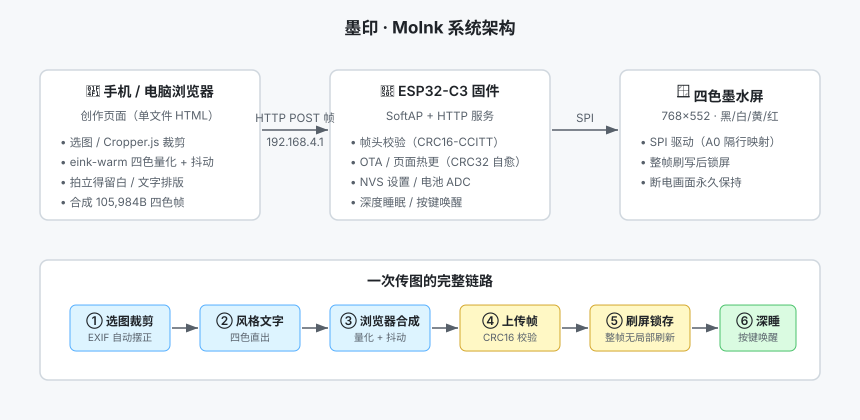
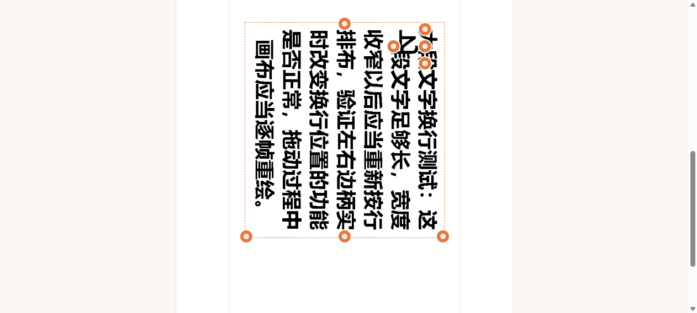

# 墨印 · MoInk 新手入门教程

> 目标：从零开始，把你的第一张照片显示在墨水屏上。
> 全程大约需要 40 分钟（含工具链安装 20 分钟）。

## 目录

1. [准备硬件](#1-准备硬件)
2. [安装开发环境](#2-安装开发环境)
3. [编译固件](#3-编译固件)
4. [给设备刷机](#4-给设备刷机)
5. [连接热点](#5-连接热点)
6. [上传第一张照片](#6-上传第一张照片)
7. [进阶：页面热更与固件 OTA](#7-进阶页面热更与固件-ota)
8. [常见问题](#8-常见问题)

---

## 系统总览

开始之前，先通过架构图了解整个系统的分工——**所有图像处理都在浏览器完成，设备只负责收帧和刷屏**：



---

## 1. 准备硬件

| 部件 | 说明 |
|------|------|
| ESP32-C3 SUPERMINI 开发板 ×1 | 注意是 **C3**，其他型号引脚不兼容 |
| 768×552 四色墨水屏 ×1 | 黑/白/黄/红，2bpp 驱动（华为拆机屏） |
| USB 数据线 ×1 | 板载 USB-Serial/JTAG，普通 Type-C 数据线即可 |
| 杜邦线若干 | 按下表连接屏幕 |
| （可选）锂电池 | 接 GPIO0 ADC 分压（470k:100k）可显示电量 |

**屏幕接线表**（固件已锁定，不可改动）：

| 屏幕引脚 | ESP32-C3 引脚 |
|----------|---------------|
| SCK | GPIO4 |
| MOSI | GPIO6 |
| CS | GPIO7 |
| DC | GPIO1 |
| RST | GPIO3 |
| BUSY | GPIO10 |
| VCC / GND | 3.3V / GND |

**唤醒按键**（可选）：GPIO5 接按键到 GND，低电平有效；长按 5 秒恢复出厂设置。

---

## 2. 安装开发环境

### 2.1 安装 Python（3.9+）

从 [python.org](https://www.python.org/downloads/) 下载安装，安装时勾选 **Add Python to PATH**。

### 2.2 安装 PlatformIO

```bash
pip install platformio
```

验证：

```bash
python -m platformio --version
```

> 💡 也可以用 VS Code + PlatformIO 插件，图形界面更友好；本教程用命令行演示。

---

## 3. 编译固件

### 3.1 克隆项目

```bash
git clone <仓库地址> moink
cd moink
```

### 3.2 编译

```bash
python -m platformio run -e moink
```

编译成功标志：日志末尾出现 `RAM:` / `Flash:` 占用行，且无 error。

> ⚠️ **Windows 中文系统注意**：如果编译末尾报 `UnicodeDecodeError`（partitions.csv 解码失败），请加环境变量重试——分区表含 UTF-8 中文注释：
>
> **PowerShell**：
> ```powershell
> $env:PYTHONUTF8="1"
> python -m platformio run -e moink
> ```
> **Linux / macOS**：
> ```bash
> PYTHONUTF8=1 python -m platformio run -e moink
> ```

### 3.3 内嵌页面说明

固件内部嵌了一份创作页面（`src/index_html.h`，由 `page/index.html` 生成）。**修改页面后必须重新生成**再编译：

```bash
python tools/make_index_header.py
python -m platformio run -e moink
```

---

## 4. 给设备刷机

### 方式 A：一键刷机包（推荐新手，免编译）

项目自带 `flash_kit/` 目录，内含预编译固件和一键脚本：

1. 用 USB 线连接开发板
2. 双击运行 `flash_kit/MoInk一键刷机.bat`
3. 等待进度走完，显示 ✅ 即成功

### 方式 B：命令行刷机

```bash
python tools/flash_moink.py
```

### 刷机成功标志

- 屏幕出现开机画面
- 手机 WiFi 列表出现热点 **`MoInk-XXXX`**（XXXX 是设备 MAC 后 2 字节，每台设备不同）

> ⚠️ **刷机排障**：若使用浏览器网页烧录器卡在 `Stub running...`（一个字节都没写进去），拔插 USB 即可恢复，然后改用上面的命令行方式（esptool 能正确处理 C3 的 USB-JTAG 握手）。

---

## 5. 连接热点

1. 手机打开 WiFi 设置，连接 **`MoInk-XXXX`**（默认无密码）
2. 大部分手机会**自动弹出**创作页面（captive portal）；没有弹出的话，打开浏览器访问：

   ```
   http://192.168.4.1
   ```

3. 看到如下界面即连接成功（右上角连接状态显示绿点）：



页面分为两个区域：**左侧/上方是创作控制区**（模式选择、裁剪、风格、文字），**右侧/下方是预览与上传区**（桌面端预览固定悬浮，调参数实时看效果）。

---

## 6. 上传第一张照片

### 6.1 拍立得模式（默认）

1. **① 选图**：点击「选择图片」，从相册挑一张照片（竖版效果最佳——页面默认竖屏构图）
2. **② 裁剪调整**：拖动裁剪框构图；双指捏合缩放、旋转；不满意可 90° 快速旋转
   - 手机直拍的照片会**自动按 EXIF 摆正方向**
3. **③ 风格与文字**（均可跳过）：
   - 风格：默认「自然暖调」适合大多数人像与食物照片
   - 留白：勾选四边可加拍立得白边（默认上下 200px / 左右 100px，可自定义）
   - 文字：勾选「添加文字」→ 输入内容 → 点「＋添加」→ 拖动手柄调整（右下缩放、右上旋转、左下调宽窄、左上红点删除）
4. **④ 上传**：点击「上传并刷新屏幕」，等待「已上传，屏幕刷新中…」提示

屏幕白屏闪烁几次属于**正常刷屏过程**（四色屏需要多轮振荡显色），几秒后画面稳定。

### 6.2 便签模式

页面顶部切换到「便签」：直接输入文字 → 调整字体/颜色/底色/描边 → 上传。适合留言条、待办提醒。

### 6.3 设备设置

主页右上角 **⚙** 进入设备设置：

| 设置 | 说明 |
|------|------|
| 设备信息 | 固件/页面/接口版本、热点名、电池电压 |
| 休眠唤醒 | 传图完成后自动深睡的延时 |
| 热点设置 | 修改热点名称与密码 |
| 系统维护 | 清理残影（黑白闪刷 2 次）、页面热更、固件 OTA、恢复出厂 |

---

## 7. 进阶：页面热更与固件 OTA

MoInk 的更新体系分**两级**，日常体验优化只需要第一级：

| 级别 | 更新对象 | 入口 | 文件 |
|------|---------|------|------|
| 页面热更 | 创作页面 UI | 设备设置 → 页面热更 | `page-R1.0.22.html`（单文件） |
| 固件 OTA | 设备固件 | 设备设置 → 固件升级 | `moink_R1.0.8_app.bin` |

- 页面热更**秒级完成**，不用刷固件；热更内容存在独立 web 分区，CRC32 校验失败会自动回退内嵌页，不会变砖
- 固件 OTA 采用双分区方案，刷失败可回滚

---

## 8. 常见问题

**Q：上传时提示「网络错误：请确认已连接设备热点」？**
手机可能自动切回了移动数据/家庭 WiFi。连接 MoInk 热点后，部分手机需要在 WiFi 高级设置里关闭「自动切换网络」，或在上传时临时关闭移动数据。

**Q：屏幕画面有残影 / 底色发灰？**
设备设置 → 系统维护 → **清理残影**（黑白全屏闪刷约 40~60 秒）。

**Q：刷机后不出热点、按键无反应？**
大概率是网页烧录器卡死（芯片停在 stub 里）。**拔插一次 USB** 即可恢复，然后改用命令行 `flash_moink.py` 刷机。若电脑识别不到串口，注意跳过无 VID 的虚拟串口（如蓝牙串行 COM 口）。

**Q：黄色/红色显示不对？**
色码映射已按实测标定锁定（0x02=黄、0x03=红），请勿自行修改驱动；如怀疑屏幕型号不同，先看 `docs/CONTRACT.md`。

**Q：想修改创作页面？**
编辑 `page/index.html`（单文件包含全部 CSS/JS），本地打开即可调试；改完跑门禁：
```bash
node tools/smoke_page.js          # 页面结构冒烟测试
python tools/check_algo.py        # 图像算法冻结比对（必须 12/12 MATCH）
python tools/make_index_header.py # 重新生成固件内嵌页
```

**Q：电池能用多久？**
传图完成后设备进入深度睡眠（电流 μA 级），墨水屏断电画面保持。具体续航取决于电池容量与传图频次，暂无实测数据（欢迎 PR 补充）。

---

*教程对应版本：fw R1.0.8 + page R1.0.22 · 如有出入以 [CHANGELOG](CHANGELOG.md) 最新条目为准*
